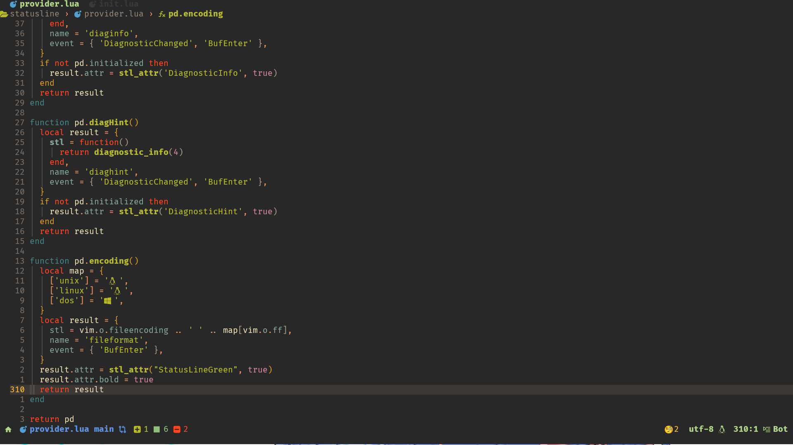

# SimpleLine.nvim
A neovim statusline and bufferline plugin

my perosnal statusline not support configuration.

## demo


## Tabline
The Tabline forked from [luatab.nvim](https://github.com/alvarosevilla95/luatab.nvim)

## statusline
The Statusline forked from [whiskyline](https://github.com/nvimdev/whiskyline.nvim)

## Installation
```lua
{
  "Kicamon/SimpleLine.nvim",
  config = function()
    require("statusline").setup()
    require("tabline").setup()
  end
}
```

## Heilght groups
please use [gruvbox.nvim](https://github.com/Kicamon/gruvbox.nvim) if you want to use SimpleLine

### License
<p align="center">
  Copyright &copy; 2023-present
</p>
<p align="center">
  <a href="https://github.com/glepnir/nvim/blob/master/LICENSE"
    ></a>
</p>
