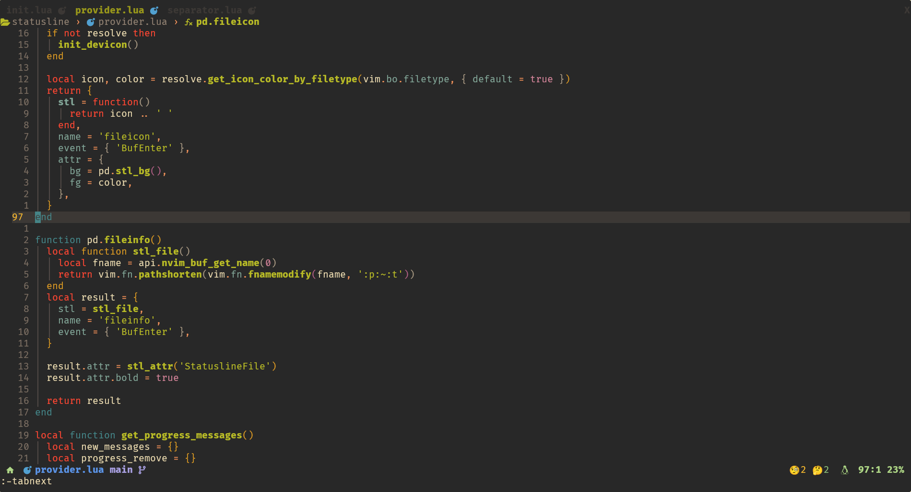

# SimpleLine.nvim
A neovim statusline and bufferline plugin

my perosnal statusline not support configuration.

## demo


## Tabline
The Tabline fork from [luatab.nvim](https://github.com/alvarosevilla95/luatab.nvim)

## statusline
The Statusline fork from [whiskyline](https://github.com/nvimdev/whiskyline.nvim)

## Installation
```lua
{
  "Kicamon/SimpleLine.nvim",
  config = function()
    require("statusline").setup()
    require("tabline").setup()
  end
}
```
